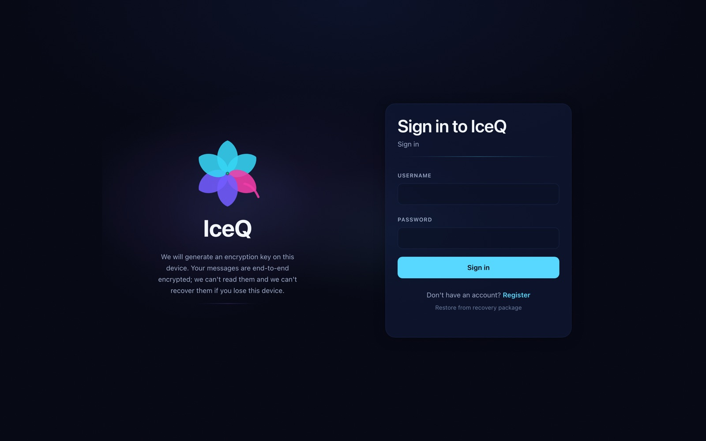
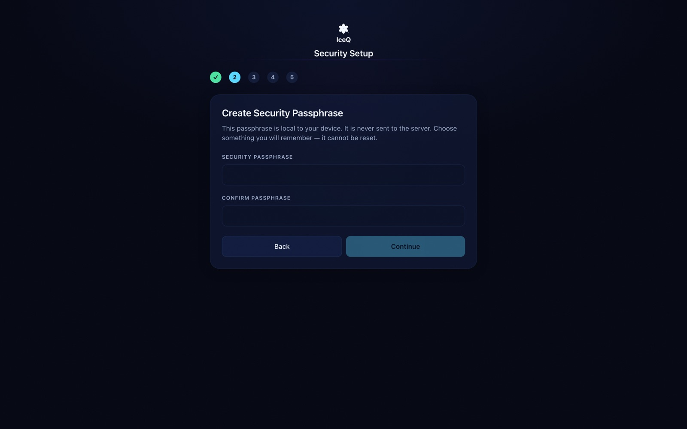
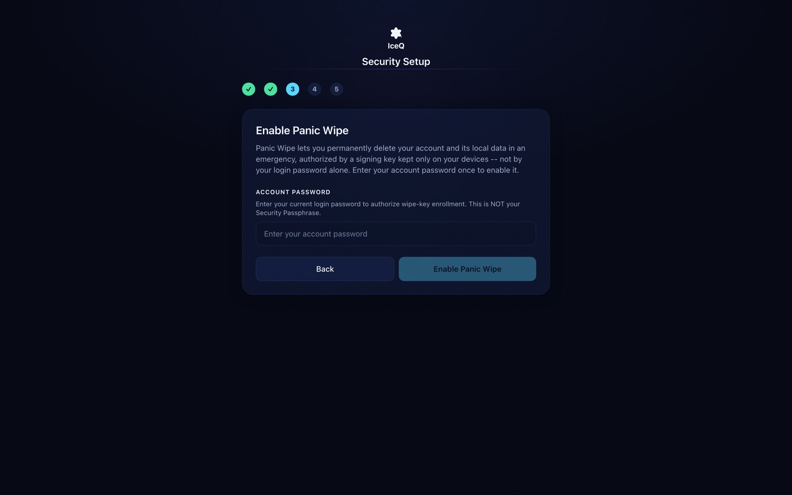
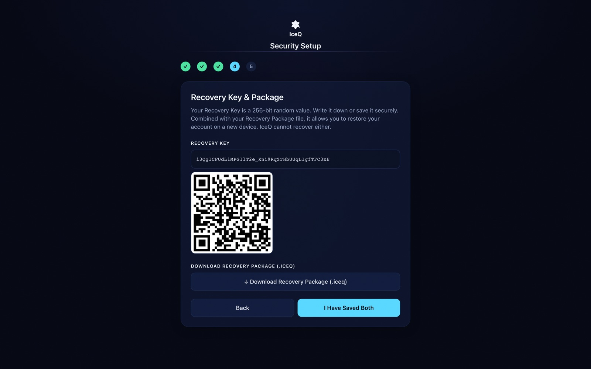
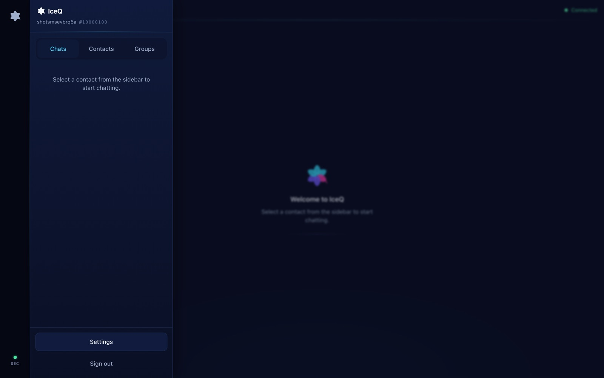
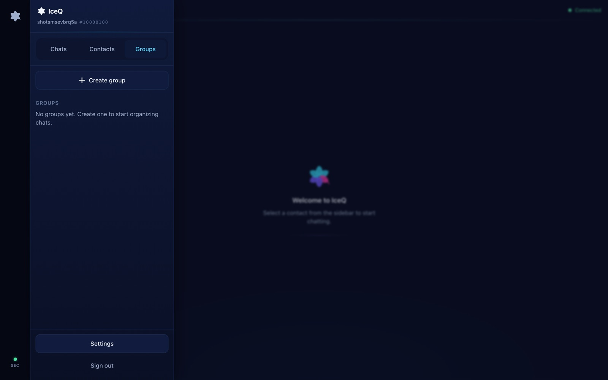
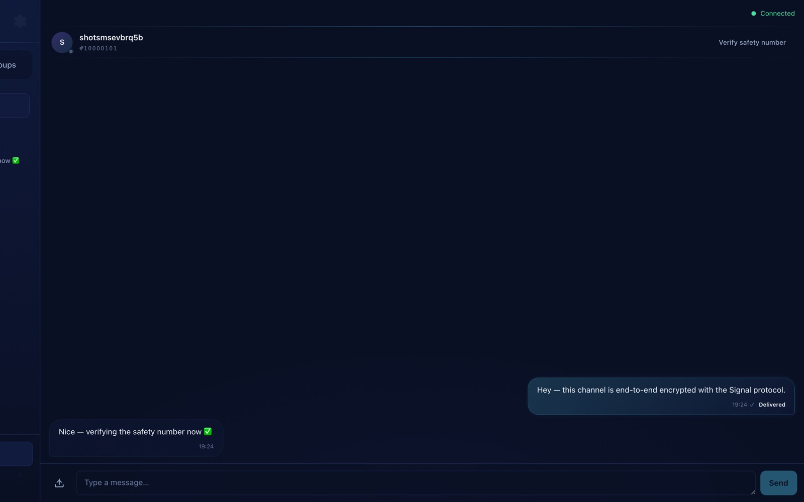
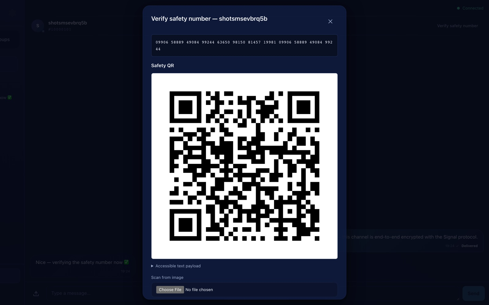
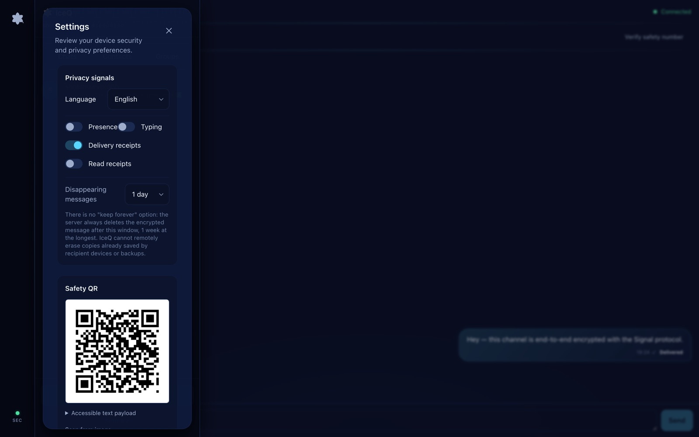
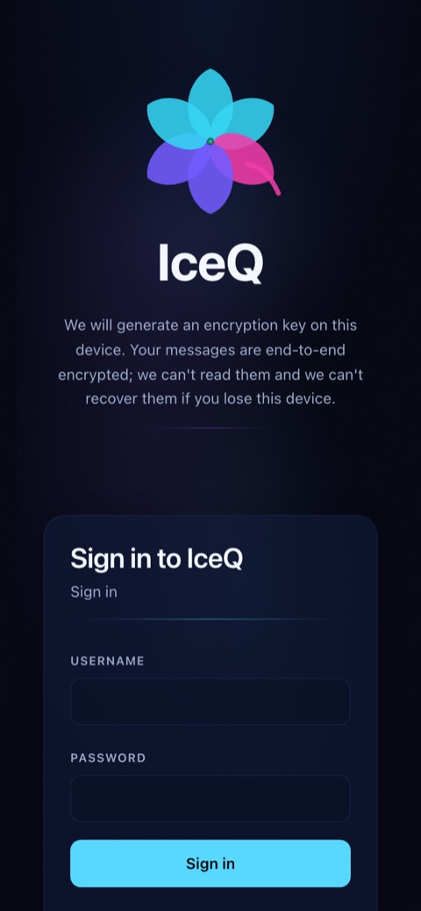

<div align="center">



# IceQ

**A privacy-first, end-to-end encrypted messenger built on the Signal Protocol.**

[](backend/go.mod)
[](web/package.json)
[](#e2ee-design)
[](#development)

</div>

IceQ is a self-hostable encrypted messenger. Direct messages use Signal Protocol primitives (X3DH + Double Ratchet) and groups use client-side Sender Keys — the server only ever receives ciphertext. It ships as a set of independent Go microservices behind Caddy, a React/TypeScript PWA frontend, and an opt-in Tor hidden-service profile, with a panic-wipe feature that durably erases an account across every storage layer on demand.

The server remains trusted for key-bundle distribution, membership, routing, availability, metadata handling, and delivery of the web application itself — see [E2EE Design](#e2ee-design) and the [threat model](docs/threat-model.md) for exactly what is and isn't covered. **The implementation has not yet received an independent cryptographic audit** — see [Security Status](docs/security-status.md) before any production use.

### Contents

[Key Features](#key-features) · [Screenshots](#screenshots) · [Architecture](#architecture) · [Tech Stack](#tech-stack) · [Quick Start](#quick-start) · [Services](#services) · [E2EE Design](#e2ee-design) · [Privacy Guarantees](#privacy-guarantees) · [Security Features](#security-features) · [Development](#development) · [Known Limitations](#known-limitations)

## Key Features

- 🔐 **True end-to-end encryption** — direct messages use Signal Protocol (X3DH key agreement + Double Ratchet); the server stores and relays ciphertext only, never plaintext
- 👥 **Encrypted group chat** — client-side Sender Keys scoped to a membership epoch, with epoch rotation on membership change and replay protection
- 🔑 **Out-of-band identity verification** — a 12-group safety-number fingerprint plus a scannable Safety QR code so both sides can confirm they share the same identity keys
- 🧨 **Panic Wipe** — a passphrase- or PIN-authenticated, challenge-signed request that starts durable asynchronous deletion of the account across Postgres, ScyllaDB, Redis, NATS, and MinIO
- 🗝️ **Local-only recovery vault** — a browser-generated recovery key + encrypted recovery package restores your encryption identity on a new device; IceQ never stores or can reset either
- 📎 **Encrypted file attachments** — files are AES-256-GCM encrypted client-side before upload; the server mints pre-signed MinIO URLs and never sees plaintext bytes
- ⏳ **Disappearing messages** — optional per-conversation TTL, server-enforced ciphertext expiry, up to one week
- 📡 **Live presence & delivery state** — WebSocket hub with NATS fan-out for presence, typing indicators, and delivery/read receipts, each individually toggleable for privacy
- 📱 **Installable PWA** — offline-capable, installable on desktop and iOS/Android home screens, with responsive layouts down to 320px
- 🧅 **Optional Tor hidden service** — an opt-in Compose profile serves the same app over a v3 `.onion` address (deferred until clearnet acceptance — see [Known Limitations](#known-limitations))
- 🇬🇧🇹🇷 **Localized UI** — fully typed EN/TR translation catalogs with parity enforced by tests
- 🛡️ **Defense-in-depth backend** — per-route rate limiting, short-lived JWTs with Redis-blocklisted revocation, Argon2id password hashing, read-only containers, `no-new-privileges`, and per-container resource limits

## Screenshots

<table>
<tr>
<td width="50%">

**Sign in**


</td>
<td width="50%">

**Security setup — passphrase**


</td>
</tr>
<tr>
<td width="50%">

**Panic Wipe enrollment**


</td>
<td width="50%">

**Recovery key & package**


</td>
</tr>
<tr>
<td width="50%">

**App shell**


</td>
<td width="50%">

**Encrypted groups**


</td>
</tr>
<tr>
<td width="50%">

**Encrypted conversation**


</td>
<td width="50%">

**Safety number verification**


</td>
</tr>
<tr>
<td width="50%">

**Privacy & security settings**


</td>
<td width="50%">

**Mobile (390×844)**


</td>
</tr>
</table>

All screenshots are from a real run of the app against the local rehearsal stack — nothing staged or mocked.

## Architecture

```
Browser / optional Tor client
      │  HTTPS / WSS (default)       │  .onion (opt-in profile)
      ▼                              ▼
┌─────────────────────────────────────────────────────┐
│  Caddy (TLS termination, rate limiting, CSP headers) │◄── caddy-tor ◄── Tor
└──────────────────────┬──────────────────────────────┘     (opt-in profile)
                       │  Docker bridge (iceq-net)
     ┌─────────────────┼──────────────────────┐
     │                 │                      │
     ▼                 ▼                      ▼
auth-service      ws-gateway           key-service
(users, tokens,   (WebSocket hub,      (Signal prekey
 contacts,         fan-out via NATS)    bundle store)
 groups)
     │                 │
     │    NATS bus     │
     └─────────┬───────┘
               │
     ┌─────────┼──────────────┐
     │         │              │
     ▼         ▼              ▼
message-    presence-      file-service
service     service        (pre-signed
(ScyllaDB   (Redis         MinIO URLs,
 ciphertext) presence map)  never sees
                            file bytes)

Infrastructure: PostgreSQL · ScyllaDB · Redis · NATS · MinIO · optional Tor
```

## Tech Stack

| Layer | Technology |
|---|---|
| Frontend | React 18, TypeScript, Vite, Zustand, Tailwind CSS |
| Cryptography (client) | `@privacyresearch/libsignal-protocol-typescript` (X3DH + Double Ratchet), client-side Sender Keys, AES-256-GCM for attachments |
| Backend | Go 1.25, one binary per bounded service (`auth-service`, `key-service`, `ws-gateway`, `message-service`, `presence-service`, `file-service`) |
| Datastores | PostgreSQL (users/contacts/groups), ScyllaDB (message ciphertext), Redis (presence, blocklist, rate limits), MinIO (S3-compatible file objects) |
| Messaging bus | NATS JetStream — inter-service fan-out and durable delivery |
| Edge | Caddy — TLS termination, CSP/HSTS headers, rate limiting; optional Tor via `goldy/tor-hidden-service` |
| Testing | Go `testing` + `-race`, Node's built-in test runner, Playwright (Chromium + WebKit, desktop + mobile emulation) |
| Delivery | Docker Compose, GitHub Actions (`security-ci.yml`) |

## Quick Start

This is a local clearnet setup. Production operators should follow the [operator runbook](docs/operator-runbook.md); current guarantees and gaps are in [security status](docs/security-status.md) and the [threat model](docs/threat-model.md).

```bash
# 1. Clone
git clone <repo-url> && cd iceq

# 2. Copy env template and fill in secrets
cp deploy/.env.example deploy/.env.local
$EDITOR deploy/.env.local   # set passwords, JWT secret, allowed origins

# 3. Build and start the default clearnet stack (Tor is excluded)
docker compose -f deploy/docker-compose.yml up --build

# 4. Open the app
open https://localhost        # accept the self-signed dev cert
```

## Services

| Service          | Internal port | Purpose                                    |
|------------------|---------------|--------------------------------------------|
| caddy            | 443 (public)  | TLS termination, rate limiting, SPA serving|
| caddy-tor (opt-in)| 80 (internal)| Isolated Tor-profile edge to clearnet policy|
| tor (opt-in)     | —             | v3 hidden service gateway to caddy-tor     |
| auth-service     | 8080          | Registration, login, JWT, contacts, groups |
| key-service      | 8081          | Signal Protocol prekey bundle distribution |
| ws-gateway       | 8082          | WebSocket hub, NATS fan-out                |
| message-service  | 8080          | ScyllaDB ciphertext persistence + history  |
| presence-service | 8080          | Online/away/offline presence map           |
| file-service     | 8080          | Pre-signed MinIO URL minting               |
| postgres         | 5432 (internal)| Users, contacts, groups, refresh tokens   |
| scylla           | 9042 (internal)| Message ciphertext store                  |
| redis            | 6379 (internal)| Presence map, JWT blocklist, rate counters |
| nats             | 4222 (internal)| Inter-service message bus (JetStream)      |
| minio            | 9000 (internal)| S3-compatible file object store            |

## E2EE Design

IceQ encrypts direct messages in the browser with Signal Protocol primitives (X3DH key agreement and Double Ratchet) using the recipient's prekey bundle. Group messages use browser-side Sender Keys scoped to a membership epoch. The server receives ciphertext rather than message plaintext, but it remains trusted for key-bundle distribution, membership, routing, availability, metadata handling, and delivery of the web application. Users should compare safety fingerprints out of band; no independent cryptographic audit has yet validated these implementations.

Direct-message safety numbers are computed client-side from the two users' UINs and identity public keys. The helper returns a stable 12-group decimal fingerprint that users can compare out of band; a mismatch means the peer identity key changed and the conversation should not be trusted until verified.

## Privacy Guarantees

- Messages are encrypted before transmission; the server stores only ciphertext
- Direct-message file attachments are encrypted client-side with AES-256-GCM before MinIO upload; the object key and decrypt manifest are carried inside the Signal-encrypted message body, not as a raw presigned URL
- Edge access logs strip client IP, User-Agent, Authorization, and Cookie fields; remaining backend UIN/username log lines are tracked as a hardening limitation
- WebSocket and message-history routes are excluded from Caddy access logs with `log_skip`
- Pre-signed file URLs: the file-service mints a URL and never sees the bytes
- Bearer tokens are bound to a Redis blocklist; logout is cryptographically enforced
- Panic wipe destructively removes the current account and managed server-side keys, contacts, memberships, sessions, and indexed ciphertext paths; it cannot erase peer devices, offline browser caches, backups/exports, or legacy ciphertext without deletion indexes
- Caddy does not forward the real client IP to backend services after edge hardening
- Optional Scylla TTL can expire encrypted message rows after a configured retention window
- `read_only` container filesystems prevent runtime tampering

## Security Features

- **Rate limiting at edge** — login 5/min, register 3/min, all API 60/min, WebSocket 10/min per IP
- **JWT rotation** — short-lived access tokens (15 min) + refresh rotation; revoked tokens blocklisted in Redis
- **Prekey replenishment contract** — frontend accepts key-service `204 No Content` responses when uploading one-time prekeys
- **HSTS + CSP** - strict self-hosted browser policy enforced by Caddy; no third-party fonts or scripts
- **Panic wipe** — an authenticated, strongly confirmed challenge-signature request starts durable asynchronous deletion of the account across managed storage layers
- **Read-only containers** — all services run with `read_only: true`; only `/tmp` tmpfs is writable
- **No-new-privileges** — `no-new-privileges:true` on every container prevents privilege escalation
- **Resource limits** — each container is capped at CPU and memory to limit blast radius

### Existing database volumes: required security migrations

Docker initdb mounts run only when a fresh, empty volume is created. Before deploying this revision onto existing PostgreSQL or Scylla volumes, compare a recorded migration ledger and the live schema with `deploy/init/migrations/`, take an encrypted backup, and run each missing migration below in numeric order.

**Guarded migrations** (retry-safe `IF NOT EXISTS` / `ADD COLUMN IF NOT EXISTS` / exception handling): 004, 005, 006, 007, 008, 009, 012, 014, 015, 016, 017. A successful retry does not prove that a pre-existing object has the expected definition.

**Unguarded migrations** (require schema inspection before applying): 010, 011, 013. These are ScyllaDB CQL `ALTER TABLE ADD` operations. CQL does not support `IF NOT EXISTS` on column additions; applying them against a schema where the column already exists will fail. Before running these, inspect the target schema with `cqlsh -e "DESCRIBE TABLE iceq.<table>;"` and skip any column that already exists.

```bash
docker compose --env-file deploy/.env.local -f deploy/docker-compose.yml exec -T postgres \
  sh -c 'psql --set ON_ERROR_STOP=1 --username "$POSTGRES_USER" --dbname "$POSTGRES_DB"' \
  < deploy/init/migrations/005_wiped_accounts.sql

docker compose --env-file deploy/.env.local -f deploy/docker-compose.yml exec -T scylla \
  cqlsh < deploy/init/migrations/004_panic_wipe_message_indexes.cql

docker compose --env-file deploy/.env.local -f deploy/docker-compose.yml exec -T postgres \
  sh -c 'exec psql -v ON_ERROR_STOP=1 -U "${POSTGRES_USER:-postgres}" -d "${POSTGRES_DB:-iceq}"' \
  < deploy/init/migrations/006_file_object_owners.sql

docker compose --env-file deploy/.env.local -f deploy/docker-compose.yml exec -T postgres \
  sh -c 'exec psql -v ON_ERROR_STOP=1 -U "${POSTGRES_USER:-postgres}" -d "${POSTGRES_DB:-iceq}"' \
  < deploy/init/migrations/007_file_object_grants.sql

# UNGUARDED — inspect schema first; skip columns that already exist
docker compose --env-file deploy/.env.local -f deploy/docker-compose.yml exec -T scylla \
  cqlsh < deploy/init/migrations/010_group_message_crypto_epoch.cql

# UNGUARDED — inspect schema first; skip columns that already exist
docker compose --env-file deploy/.env.local -f deploy/docker-compose.yml exec -T scylla \
  cqlsh < deploy/init/migrations/011_disappearing_messages.cql

docker compose --env-file deploy/.env.local -f deploy/docker-compose.yml exec -T scylla \
  cqlsh < deploy/init/migrations/012_durable_message_ingest.cql

# UNGUARDED — inspect schema first; skip columns that already exist
docker compose --env-file deploy/.env.local -f deploy/docker-compose.yml exec -T scylla \
  cqlsh < deploy/init/migrations/013_group_recipient_snapshot.cql

docker compose --env-file deploy/.env.local -f deploy/docker-compose.yml exec -T postgres \
  sh -c 'psql --set ON_ERROR_STOP=1 --username "$POSTGRES_USER" --dbname "$POSTGRES_DB"' \
  < deploy/init/migrations/014_panic_wipe_pin.sql

docker compose --env-file deploy/.env.local -f deploy/docker-compose.yml exec -T postgres \
  sh -c 'psql --set ON_ERROR_STOP=1 --username "$POSTGRES_USER" --dbname "$POSTGRES_DB"' \
  < deploy/init/migrations/015_wipe_public_key.sql

docker compose --env-file deploy/.env.local -f deploy/docker-compose.yml exec -T postgres \
  sh -c 'psql --set ON_ERROR_STOP=1 --username "$POSTGRES_USER" --dbname "$POSTGRES_DB"' \
  < deploy/init/migrations/016_wipe_jobs.sql

docker compose --env-file deploy/.env.local -f deploy/docker-compose.yml exec -T scylla \
  cqlsh < deploy/init/migrations/017_user_erasure_indexes.cql
```

Credentials expand only inside the containers and passwords are not printed. Verify PostgreSQL before restarting authenticated services; migration 016 also contains the exact `wipe_jobs` column query:

```bash
docker compose --env-file deploy/.env.local -f deploy/docker-compose.yml exec -T postgres \
  sh -c 'psql --set ON_ERROR_STOP=1 --username "$POSTGRES_USER" --dbname "$POSTGRES_DB" --command "SELECT to_regclass('"'"'public.wiped_accounts'"'"');"'
```

Verify the deletion indexes, expiry columns, durable ingest receipt, and outbox tables. This command exits non-zero if any required object is missing:

```bash
docker compose --env-file deploy/.env.local -f deploy/docker-compose.yml exec -T scylla \
  sh -ec 'tables="$(cqlsh --no-color -e "SELECT table_name FROM system_schema.tables WHERE keyspace_name = '\''iceq'\'';")"; columns="$(cqlsh --no-color -e "SELECT table_name, column_name FROM system_schema.columns WHERE keyspace_name = '\''iceq'\'' AND column_name = '\''expires_at'\'';")"; for table in message_deletion_index group_message_deletion_index message_ingest message_outbox group_message_outbox message_ingest_erasure_index message_outbox_erasure_index group_message_outbox_erasure_index; do printf "%s\n" "$tables" | grep -qw "$table"; done; printf "%s\n" "$columns" | grep -E '\''messages[[:space:]]*\\|[[:space:]]*expires_at'\''; printf "%s\n" "$columns" | grep -E '\''group_messages[[:space:]]*\\|[[:space:]]*expires_at'\'''
```

Rollout ordering is service-specific:

1. Apply and verify migrations `004_panic_wipe_message_indexes.cql`, `010_group_message_crypto_epoch.cql`, `011_disappearing_messages.cql`, `012_durable_message_ingest.cql`, `013_group_recipient_snapshot.cql`, and `017_user_erasure_indexes.cql` **before starting the updated message-service and auth-service cleanup worker**; otherwise durable receipts/outbox, immutable group recipient snapshots, required message metadata, or bounded user erasure may be unavailable.
2. Apply and verify migration `005_wiped_accounts.sql` **before starting the updated auth-service or ws-gateway**. Until 005 exists, JWT validation cannot prove durable revocation and fails closed, so authenticated REST requests and WebSocket authentication/message checks are rejected.
3. Apply and verify migrations `014_panic_wipe_pin.sql`, `015_wipe_public_key.sql`, and `016_wipe_jobs.sql` **before starting the updated auth-service**. Migration 016 is a startup requirement: the background wipe worker fails closed if the durable job table is missing or malformed.

## Optional Tor Hidden Service

> Current phase: deferred. Do not enable this profile or advertise an onion address until the clearnet deployment has passed real-user acceptance. The commands below document the retained opt-in scaffold for that later phase.

The default Compose command starts only the clearnet stack. Tor remains available as an explicit profile for later testing; it is not part of the current `iceq.space` rollout. When enabled, the `.onion` address is auto-generated on first boot and stored in the `tor_keys` Docker volume. `Onion-Location` is emitted only after an operator sets a non-empty `ICEQ_ONION_LOCATION` in `deploy/.env.local`; leaving it absent keeps clearnet responses free of onion advertising.

Validate this contract at any time:

```bash
./deploy/scripts/check-clearnet-compose.sh
```

Without the project Caddy image and a running Docker daemon, this command reports a structural `STATIC PASS` and an explicit runtime `SKIP`. Runtime Caddy parsing and live response headers remain a required later Docker/deployment gate.

### Get your .onion address

```bash
docker compose -f deploy/docker-compose.yml --profile tor up -d
./deploy/scripts/onion-address.sh
```

The script polls the Tor container until its locally generated v3 keypair has produced a `hostname` file, then prints a URL like:

```
http://iceq...abc...xyz.onion
```

It also prints the exact `ICEQ_ONION_LOCATION=http://...onion` line to add to `deploy/.env.local`. Keep this value on the v3 onion URL; do not point Onion-Location at a clearnet domain.

Open that address in a Tor-capable browser (Tor Browser, Brave with private window + Tor, etc.) to use IceQ over the Tor network.

The local `hostname` file proves only key/address generation. It does not prove Tor directory consensus publication or external reachability; those require a separate Tor-network connectivity test during the later Tor integration phase.

### Backup your .onion keypair (CRITICAL)

Your `.onion` address is derived from a private key stored in the `tor_keys` Docker volume. **If this volume is deleted, your address is lost forever and cannot be recovered** — Tor has no recovery mechanism for v3 keys.

**Backup:** use the production backup system to stream the read-only `iceq_tor_keys` volume directly into an authenticated, encrypted offline sink. Do not create an intermediate archive under the repository or another unencrypted filesystem. Keep the encryption credential in the backup system's protected secret input, never in a command argument, environment dump, terminal transcript, or log. Record only a non-secret backup identifier and integrity result.

**Restore:** stream the authenticated decryption result from the protected offline backup system directly into an empty `iceq_tor_keys` volume. Do not print, inspect, or log archive members or private-key contents. The exact command is intentionally operator/platform-specific because a generic shell example would either expose a passphrase or create plaintext key material. Perform the restore in an isolated environment first.

After a restore, restart the Tor container to pick up the keypair:

```bash
docker compose -f deploy/docker-compose.yml --profile tor restart tor
./deploy/scripts/onion-address.sh   # should print the same address
```

### How it works

```
Tor Browser ──► Tor Network ──► iceq-tor ──► caddy-tor (:80, profile-only)
                                               │
                                               └─► default Caddy HTTPS edge
                                                   (shared routes/policy)
```

> **Why plain HTTP into the profile edge is acceptable for this deployment:** Tor provides transport encryption between the client and the Tor container. The Tor-to-`caddy-tor` hop stays inside Docker's internal `iceq-net` bridge and is not host-exposed; the next hop to default Caddy uses HTTPS.

The `goldy/tor-hidden-service` container:
- generates a v3 ed25519 keypair on first boot and persists it in `tor_keys`
- strips Tor's transport encryption and forwards plain HTTP into the Docker network
- exposes the v3 onion address via its `hostname` file (used by the script above)

The default Caddy loads no Tor-only `:80` listener. Enabling the `tor` profile starts the isolated `caddy-tor` internal edge, which forwards onion requests to the default Caddy HTTPS policy surface with normal certificate validation and `iceq.space` SNI. Its healthcheck traverses that same proxy path to the non-sensitive `/health` route, so Tor waits for upstream TLS and route readiness rather than a local synthetic response. This keeps Tor listeners absent from the default stack while reusing the clearnet routes and security headers.

### Security note

Tor can provide transport-layer anonymity for clients reaching an accepted and externally verified onion service. Message encryption protects plaintext from passive storage/transport observers and honest operator logs that receive ciphertext only. It does not protect against a malicious or compelled operator who changes the served web application: the browser is the E2EE trust boundary, and hostile JavaScript can capture keys and plaintext. Tor also does not remove application timing, size, membership, or routing metadata.

## Development

### Existing-volume file authorization migration

Fresh PostgreSQL volumes apply file ownership/grant migrations through the
top-level Compose init mounts. The official image does not rerun init scripts
for an existing volume. Before deploying code that issues file grants, back up
PostgreSQL and apply both idempotent migrations in order:

```bash
docker compose --env-file deploy/.env.local -f deploy/docker-compose.yml exec -T postgres \
  sh -c 'exec psql -v ON_ERROR_STOP=1 -U "${POSTGRES_USER:-postgres}" -d "${POSTGRES_DB:-iceq}"' \
  < deploy/init/migrations/006_file_object_owners.sql
docker compose --env-file deploy/.env.local -f deploy/docker-compose.yml exec -T postgres \
  sh -c 'exec psql -v ON_ERROR_STOP=1 -U "${POSTGRES_USER:-postgres}" -d "${POSTGRES_DB:-iceq}"' \
  < deploy/init/migrations/007_file_object_grants.sql
```

Verify without expanding or printing credentials in the host shell:

```bash
docker compose --env-file deploy/.env.local -f deploy/docker-compose.yml exec -T postgres \
  sh -c 'exec psql -v ON_ERROR_STOP=1 -U "${POSTGRES_USER:-postgres}" -d "${POSTGRES_DB:-iceq}" -c "\\d file_objects" -c "\\d file_object_grants"'
```

Legacy MinIO UUIDs
remain unavailable unless the operator has a separate trusted record mapping
each UUID to its uploader. Never infer ownership from message metadata, bucket
listing order, timestamps, or possession of the UUID. Import a verified mapping
into a staging table, validate every referenced UIN and UUID, then insert with
an explicit reviewable query such as:

```sql
INSERT INTO file_objects (object_key, owner_uin)
SELECT object_key, owner_uin FROM verified_file_owner_backfill
ON CONFLICT DO NOTHING;
```

Rollback application code before rolling back schema. After confirming no
running version queries these tables, remove grants first, then owners:
`DROP TABLE file_object_grants; DROP TABLE file_objects;`. This removes access
metadata, not MinIO ciphertext. Restore the database backup if any backfill was
incorrect; do not synthesize replacement ownership.

```bash
# Build all Go services
cd backend && go build ./...

# Run unit/integration tests
cd backend && go test ./...

# Build the frontend
cd web && npm ci && npm run build

# Smoke tests (requires running Docker stack)
cd backend && go run ./cmd_smoke_step10/
```

## Security Status and CI

The current implementation status for the requested Tor, E2EE, backend-hardening, anonymity, frontend, and delivery work is tracked in [`docs/security-status.md`](docs/security-status.md).

GitHub Actions workflow [`security-ci.yml`](.github/workflows/security-ci.yml) runs Go tests/vet/govulncheck, web tests/typecheck/build, moderate-severity release audits of all and production dependencies, secret scanning, and Docker Compose model validation. Compose validation does not start the stack or prove runtime behavior.

## Known Limitations

- **Batch read receipts** — read receipts are per-message; a bulk-ACK endpoint is not yet implemented
- **Push notifications** — offline push (APNs/FCM) is not implemented; unread messages are delivered on next WebSocket reconnect
- **Legacy bcrypt accounts** - new passwords use Argon2id; existing bcrypt hashes upgrade automatically after a successful login
- **WebSocket bearer compatibility** - refresh tokens now use HttpOnly cookies, but WebSocket auth still needs the short-lived access token until ws-gateway supports cookie auth
- **Metadata-reduced message storage** - optional message TTL is available, but conversation IDs and sender/receiver routing metadata still need a deeper minimization redesign
- **Independent review and production acceptance** — repository tests do not replace a cryptographic audit, penetration test, backup/restore rehearsal, or clearnet real-user acceptance
- **Tor runtime** — opt-in Compose assets exist, but boot, consensus publication, onion reachability, and DNS-leak testing are intentionally deferred until after clearnet acceptance
